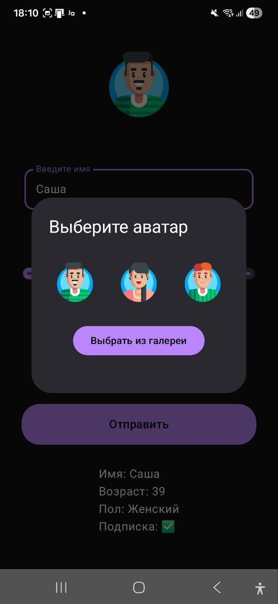
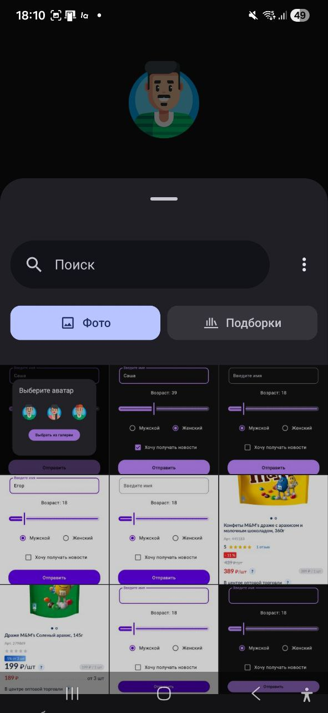

# 🏠 Домашнее задание №1 "Анкета пользователя"

## 🌅 Стартовый экран
### 🖼️ Светлая тема

## 🌙 Стартовый экран (тёмная тема)

## 📋 Выведенные данные
### 🖼️ Светлая тема  

## 🌑 Выведенные данные (тёмная тема)

## 🤗 Возможность изменять аватарку

## 😍 А также возможность выбрать фотку из галереи

## 👺 Вывод ошибки

## 📺 Демо работы + альбомная ориентация
<video src="app/src/main/res/drawable/demo.mp4" width="320" height="240" controls></video>

# Гук Егор Михайлович РИ-330940 😉