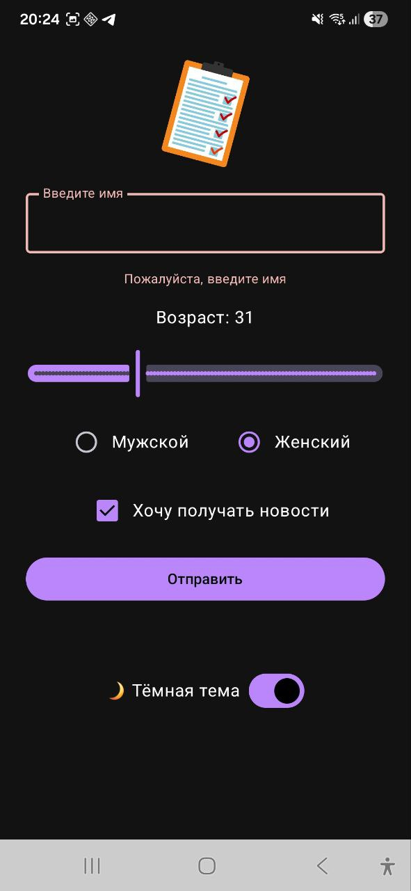

# 🏠 Домашнее задание №1 "Анкета пользователя"

## 🌅 Стартовый экран
🖼️ Светлая тема

## 🌙 Стартовый экран (тёмная тема)

## 📋 Выведенные данные
🖼️ Светлая тема  

## 🌑 Выведенные данные (тёмная тема)

## 👺 Вывод ошибки

## 📺 Альбомная ориентация
